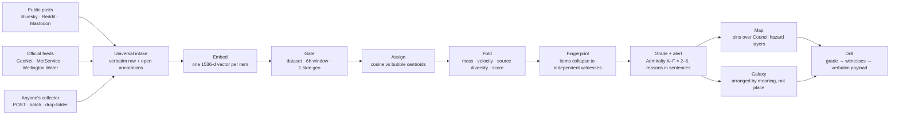

# Impact Lab Wellington — Team 4

**Wellington City Council Emergency Management × Claude Code Community NZ**
Saturday 8 August 2026 · Waimanga Room, Wellington City Council

**▶ Demo video:** https://www.loom.com/share/f0cb8f9536ff4d31b4f994065b299238

---

## Problem 03 — Identify and verify emerging local impacts from public information

> How might we use public online information to identify where emergency impacts may be emerging, while making the reliability and limitations of that information clear?

A prototype could collect relevant public posts, local news and community reports; identify likely locations and issue types; and show where several independent sources appear to describe the same event. It would not present social-media content as verified fact. It would identify signals for an intelligence team to investigate.

There may be an opportunity to develop this option in collaboration with doctoral research at Massey University's Joint Centre for Disaster Research, on multimodal generative AI for disaster situational awareness using social media. Early discussions with the WCC Emergency Management team have already identified possible overlap. Any collaboration would need to be agreed with the researcher and Massey University.

**Desired outcome:** WCC can detect possible impacts earlier and direct staff attention to matters needing confirmation.

*The common theme is improving the flow and use of information between communities and Council before and during an event.*

---

## What we built

**An engine that turns arbitrary public information into a ranked, auditable queue of places an intelligence officer should look** — and never into "facts".

Any collector, any feed, any file can hand it anything with a readable sentence in it. The engine stores the payload losslessly, embeds the sentence into a vector space, gates by geography and time, groups items that appear to describe the same event into a **bubble** (a candidate event), collapses reposts and echoes so the count on screen is independent **witnesses** rather than documents, grades the result on the two Admiralty axes with the reasons written out in sentences, and shows it on a live board — a geographic map and a semantic galaxy — where each bubble's **size, velocity and source diversity** tell the operator what is growing and how fast. One click drills from any bubble to the verbatim words that built it.

The gap it closes is the one a duty officer described to us in their own words: *"we don't use social media at all… we don't trust social media"* — followed by an account of checking it anyway and thinking *"I'm seeing five reports versus one."* Counting corroboration by hand, with no way to defend it or record it. The engine does that counting defensibly and writes down every reason it used.

**Prove it in two commands:**

```bash
npm run proof:grading   # 56 assertions on the pure rule table — no db, no clock, <1s
npm run verify          # 66 end-to-end through the real procedures over HTTP
```

`proof:grading` tells you which RULE broke; `verify` tells you the whole chain
holds. `verify` wipes the database and starts a dev server if one is not
running, so it really is one command — but never run it once a demo dataset is
loaded.

Four-minute demo script: [DEMO.md](DEMO.md) · Integration guide for other teams: [INTEGRATION.md](INTEGRATION.md)

---

## How the engine works

Three stages: **collect** anything, **score** it into ranked candidate events, **show** it so an operator can see where to look and why.



### 1 · Collect — any source, losslessly

The intake is deliberately universal, because the sources that matter in an emergency are precisely the ones nobody designed a schema for. Three ways in, all landing in the same store:

- **Push** — `signals.ingest` / `signals.ingestBatch`: any JSON object; the minimal valid payload is `{"text": "..."}`. One bad item never sinks a batch; every item gets a verdict. Dedupe is a unique database index, so ten simultaneous deliveries of the same report still leave one row.
- **Pull** — drop a `.json` file into `data/inbox/`; a poller workflow ([`workflows/inbox-poller.ts`](workflows/inbox-poller.ts)) runs it through the same adapter and ingest path, then moves it to `processed/` or `failed/`.
- **Collectors** — `signals.collect` (also `npm run signals:collect`) runs six collectors against real public endpoints: Bluesky search, r/Wellington via RSS, Wellington Water fault reports, MetService CAP alerts, GeoNet quakes and GeoNet felt reports ([`use-cases/signals/`](use-cases/signals/)). A collector that fails is recorded per source and never sinks the run — a live picture that says "5 of 6 sources responded" beats a dead one.

Storage is **lossless**: the original payload sits verbatim in `raw` forever, and any top-level scalars are promoted to open key/value *annotations* — fields we have never seen before survive the round trip and come back out of the drill view. Nothing is normalised away. If `occurred_at` is missing we assume receipt time and *say so* via an `assumed_occurred_at` annotation, because a guessed timestamp presented as data is a small lie that compounds.

At the collector edge, enrichment infers what it can and **flags every inference**: hazard type classified from text, place names resolved from prose (marked as inferred, never presented as GPS), authors pseudonymised before anything touches disk, and quoted URLs extracted — the raw material the independence checks need later ([`use-cases/signals/signal-enrichment.ts`](use-cases/signals/signal-enrichment.ts)).

### 2 · Score — the vector pipeline

**Why vectors:** field schemas never survive contact with a second data source, but every source can produce a sentence — and an embedding puts every sentence into one space. That is what makes the intake genuinely arbitrary: a gauge reading, a Reddit post and another team's scraped row need zero schema negotiation to be compared, and the problem statement's core ask — *"show where several independent sources appear to describe the same event"* — becomes computable geometry: independent points landing close together.

The pipeline is one idempotent verb — **embed → gate → assign → fold → fingerprint → grade** — run over unplaced items in `occurred_at` order ([`use-cases/vectors/process-pending-use-case.ts`](use-cases/vectors/process-pending-use-case.ts)):

1. **Embed.** Each item's sentence becomes a 1536-dimension vector (`openai/text-embedding-3-small` via AI Gateway; a deterministic lexical stub without a key — see limits below). Which embedder placed each item is recorded on the item as an annotation, because a bubble built by the stub and one built by the real model are not the same claim.
2. **Gate — before similarity ever gets a vote.** Candidates must be in the same dataset namespace (a replayed drill must never corroborate a live event), alive within a 6-hour window, and — when both sides have coordinates — within a **hard 1.5 km geographic gate**. "Flooding in Aro Valley" and "flooding in Petone" score ~0.95 cosine and are always two incidents; semantic closeness never overrules geography. An item with no coordinates skips the gate: absent geography can't help, but it must never block grouping.
3. **Assign.** Cosine similarity against each surviving bubble's centroid; the best match wins if it clears the join threshold, otherwise the item seeds a new bubble. Every placement is written down twice — as a number (edge weight) and as a sentence an operator can read: *"cosine 0.87; 400m and 12min apart"*, or for a refusal, *"closest match scored 0.95 but sits 8.2km away (hard gate 1.5km)"* ([`use-cases/vectors/assign-signal-use-case.ts`](use-cases/vectors/assign-signal-use-case.ts)).
4. **Fold.** Every cached metric on a bubble is a pure fold over its members — truncate and replay, and the same numbers come back. The fold produces **mass** (member count), **velocity** (members in the last hour of the bubble's *own* clock), **source diversity** (distinct source classes), a geographic centroid from the located members, and the queue rank: `score = mass × 0.5^(age / 6h half-life)`. Deliberately the simplest defensible ranking — two inputs an operator can check by eye — and the arithmetic ships on every bubble as a sentence (`scoreBreakdown`), because a queue nobody can audit is a queue nobody will act on.
5. **Fingerprint — witnesses, not documents.** Before anything is graded, [`utilities/origin-fingerprint.ts`](utilities/origin-fingerprint.ts) collapses copy-pasted wording, items that merely quote an already-counted URL, and repeat authors — so 21 items can honestly report **14 independent witnesses**, with the sentence explaining each collapse. A repost is not a second witness; one prolific account cannot manufacture corroboration. "Twenty-one independent reports" is precisely the sentence that makes somebody send a truck.
6. **Grade.** The Admiralty system, two axes never blended: source reliability A–F from a registry that defaults to F, credibility 2–6 from corroboration rules ([`utilities/grading.ts`](utilities/grading.ts)). Every grade carries ordered `reasons[]` naming the evidence it used — including the caveat that reliability reports the *best* source, not the crowd. **Credibility 1 ("confirmed") is unreachable: the grading module throws rather than write it.** Confirmation is a human's word.
7. **Alert.** Transitions, never states — and `alertWorthy` is computed **independently of the grade**. In hour zero there are no independent origins yet, so every first report grades badly; a grade threshold would go silent in exactly the hour Council is most blind. Instead the alert asks "is there somewhere to send someone?" and carries its own weakness in writing (`alertReasons`).

The whole pipeline is deterministic and replayable: `now` is a parameter, not a wall-clock read, so a replayed fixture grades identically on any machine on any day — which is also what makes it provable in 56 assertions without a database.

### 3 · Show — the operator surface

One board (`/board`), one selection, two arrangements of the same evidence:

- **Map** — every bubble is a pin at its geographic centroid, drawn **over the Council's own hazard geography** from the shared WCC GIS catalogue (tsunami evacuation zones, ponding areas, emergency routes, community emergency hubs, water tanks), so a flooding report lands visually inside the ponding area it is describing. Pins carry the grade chip and alert state.
- **Galaxy** — the same bubbles projected by *meaning* rather than place ("Position = what was said, not where"). This is the view for spotting that two things reported in different suburbs are the same problem. Items awaiting projection are counted and left undrawn, never guessed onto the canvas.
- **Drill** — click any bubble: the grade and every reason behind it, the witness count with the collapse explanations ("21 items trace back to 14 distinct observations", with a *same origin as another item* badge on each echo), every member with all its annotations, why it was placed (the cosine-and-distance sentence), and the **verbatim raw payload**. Full traceability from a pin on the map back to the exact words someone published.

The board polls every 3 seconds, so the picture is live at write time: a bubble gaining members visibly inflates.

### Velocity and scope — watching an incident develop

The point of the fold metrics is that an emerging incident has a *shape over time*, and the operator can see it without reading a single post:

- **Velocity** — reports in the last hour of the bubble's own clock. A bubble at velocity 6 is accelerating; a bubble at velocity 0 has gone quiet.
- **Scope** — mass, distinct sources, distinct source *classes*, and geographic spread. Three human reports is chatter; three human reports **plus** a sensor **plus** an official feed, spread across 800 m, is an event with edges.
- **Rank** — `mass × recency decay` keeps the queue honest in both directions: a big-but-stale bubble sinks; a small-but-accelerating one climbs. Corroboration raises a bubble, silence lowers it.

So the operator's question — *where should I look first, and what am I looking at?* — is answered by the ranked list, and the follow-up — *why should I believe the ranking?* — is answered by the arithmetic printed on every bubble.

### Future state — a reasoning layer over the groupings

The grouping-first design is what makes an LLM layer safe and cheap to add: the model would aggregate **over one bubble's members** — a bounded, relevant, already-deduplicated context — never over the raw firehose. Today the engine already uses Claude to *name* bubbles when a Gateway key is present (reading the member reports; a `hazard — locality` template without one, and the UI is told which it was). The natural next steps, in order:

1. **Per-bubble situation reports** — an LLM summarises a bubble's members into a three-sentence sitrep with a citation per sentence back to member items. The deterministic pipeline stays the system of record: the model writes prose, it never grades.
2. **Authoritative cross-check** — wire river gauges and susceptibility layers into the existing `hazardCrossCheck` seam. This activates the two dormant rules: credibility 2 ("probably true" — an authoritative layer agrees) and credibility 5 ("improbable" — telemetry contradicts the claim). The Karori-reservoir rumour in [DEMO.md](DEMO.md) is the exact test case.
3. **Level-2 themes** — the assign verb is level-parameterised; the same code that groups items into incidents can group bubbles into themes ("water network failures across the eastern suburbs"), giving the LLM layer a second altitude to summarise at.
4. **Multimodal** — images attached to posts embedded into the same space, the direct overlap with Massey JCDR's doctoral research named in the problem statement.

---

## Against the judging criteria

| Criterion | Where the evidence is |
|---|---|
| **Usefulness to WCC** (30) | The engine automates the exact task a duty officer described doing by hand — counting "five reports versus one" — and does it defensibly: independent witnesses instead of raw counts, a grade with its reasons, an attention queue ranked by mass and recency with the arithmetic printed on it. It composes into the shared common operating picture rather than competing with it: `signals.geojson` serves the bubbles with geographic centroids any other team's map can plot, and the intake accepts any other team's collector today ([INTEGRATION.md](INTEGRATION.md)). The alert design is built for Council's actual blind spot — hour zero — where a naive quality threshold would go silent. |
| **Works with real data** (25) | Six collectors hit live public endpoints: Bluesky, Reddit, Wellington Water faults, MetService CAP, GeoNet quakes and felt reports — and real harvested corpora are committed under [`data/raw/`](data/raw/) (Reddit, Mastodon, mixed news feeds, GeoNet felt-by-suburb, MetService CAP XML). The map renders five real layers from the WCC Emergency Management GIS catalogue under the signal pins. The *demo* dataset is synthetic **by design and labelled as such at every level** — a demo about trustworthiness must not stage a fake real incident, so every synthetic item is flagged `synthetic` in the API and the board header says **Demo**. |
| **Working demo** (20) | Two commands stand the demo up ([DEMO.md](DEMO.md)); 39 items become 13 candidate events on a live board with drill-through to raw payloads. The demo's claims are machine-checked: `npm run proof:grading` (56 assertions on the pure rule table, under a second) and `npm run verify` (66 assertions end-to-end through the real HTTP procedures). Every number in the demo script was read off the running system, not estimated. |
| **Honest about limits** (15) | Honesty is enforced in the data model, not the slide deck: credibility 1 is unreachable (the code throws), the unwired hazard cross-check reports `no_applicable_layer` in every reasons array rather than implying agreement, stub embeddings are recorded per item as data, assumed timestamps are annotated as assumed, inferred locations are flagged as inferred, and `verification` counts corroboration without ever asserting truth. The full limits list — including the one a sharp judge will find — is below and in [DEMO.md](DEMO.md). |
| **Path to real use** (10) | The read shapes are frozen and documented for other teams; the three seams for productionising are already shaped (`hazardCrossCheck` for authoritative layers, `TRUST_API_URL` for an external scoring service, `SIGNALS_INGEST_URL` for onward delivery); all logic lives in transport-free use cases callable from a cron or workflow, so "going live" is scheduling the collectors, not rewriting the engine. The Massey JCDR collaboration named in the problem statement maps directly onto the multimodal step above. |

---

## Status in detail

### What works

| | |
|---|---|
| **Intake, push** | `signals.ingest` / `signals.ingestBatch` — any JSON object, one bad item never sinks a batch, dedupe on `source`+`text`+`occurred_at` enforced by a unique index (ten simultaneous deliveries still leave one row) |
| **Intake, pull** | drop `.json` files in `data/inbox/`; the poller workflow moves them to `processed/` or `failed/` |
| **Collectors** | `signals.collect` / `npm run signals:collect` — Bluesky search, r/Wellington RSS, Wellington Water faults, MetService CAP, GeoNet quakes + felt reports; per-source failure tolerated and reported ("5 of 6 sources responded"); enrichment classifies hazard, resolves places from prose (flagged as inferred) and pseudonymises authors before anything touches disk |
| **Lossless storage** | your payload verbatim in `raw`, forever; top-level scalars promoted to open annotations; `occurred_at` optional and *said so* via an `assumed_occurred_at` annotation |
| **Grouping** | `vectors.process` — embed → assign → name → project; time window, then a hard 1.5km geo gate, then cosine. Every `member_of` edge carries a weight **and** a sentence |
| **Reads (frozen shapes)** | `vectors.points` (galaxy), `vectors.groups` (bubbles + **geo centroids** other teams can plot), `vectors.groupDetail` (bubble → members → all annotations → verbatim `raw`) |
| **Independent origins** | `utilities/origin-fingerprint.ts` collapses copy-paste text, quoted-URL inheritance and repeat authors, so 21 items can honestly report 14 witnesses. `signals.detail` returns the origin groups **with the sentence explaining each collapse** |
| **Grading** | `utilities/grading.ts` — Admiralty A–F × 2–6, two axes never blended, reliability from a registry that defaults to F. Every grade carries ordered `reasons[]` naming the evidence it used |
| **Alerting** | `signals.alerts` — transitions, never states. `alertWorthy` is computed **independently of the grade**, so an early single-source report alerts with its weakness written into `alertReasons` |
| **Trust surface** | `signals.ingest` (folds synchronously and returns the cluster's grade), `signals.geojson`, `signals.detail`, `signals.alerts`; `asAt` replays the picture as it stood |
| **Honesty** | `verification` counts corroboration, never asserts truth; the embedder used is recorded per signal as an annotation; credibility **1 is unreachable** — the grading module throws rather than write "confirmed" |

### What is stubbed

**Embeddings, until `AI_GATEWAY_API_KEY` is set.** With no key the pipeline uses
a deterministic lexical stub of the same 1536 dimensions, so everything
downstream works today; grouping is by shared words, not meaning ("inundation"
will not match "flooding"). Say it precisely on stage: **with the stub, cosine
RANKS correctly while geography and time SEPARATE** — over the fixtures,
same-hazard pairs average 0.85 against different-hazard 0.79, so the
distributions overlap and the partition you see is produced mostly by the 1.5km
gate and the 6h window. The semantic signal is real but works by argmax (the
ungeolocated fixtures pick their true bubble at 0.93 versus 0.85 for the
runner-up), not by the threshold. For the *gated* pipeline the correct 13/11/1
partition holds anywhere from 0.60 to 0.80, so 0.80 is a safe default rather than
a tuned one. Set the key and the same code path calls
`openai/text-embedding-3-small` instead — no code change, and the join threshold
switches with it. **Bubble names** use the same switch: a
`hazard — locality` template without a key, Claude reading the member reports
with one. Both are reported honestly (`stubEmbeddings`, `stub`) so a UI can say
which it was.

**The authoritative cross-check, entirely.** No river-gauge or susceptibility
lookup is wired to a claim, so `hazardCrossCheck` reports `no_applicable_layer`
on every cluster and says so in every `reasons` array. This is why nothing in
the system reaches credibility 2 — that rule requires an authoritative layer to
*agree* — and `verify` asserts exactly that. The contradiction rule (credibility
5) is built and proven, waiting only for the lookup. It is the highest-value
next thing to build, and the seam is shaped for it:
`clusterFactsFromItems` takes an optional `hazardCrossCheck` that overrides the
honest default.

**Collection is on-demand, not scheduled.** The six collectors are real and hit
live endpoints, but nothing runs them on a cron yet — "live" means "as fresh as
the last run". Harvested output lands in gitignored `data/signals/` (this repo
is public; the harvest contains public posts and street-level fault reports) and
joins the board through the same intake as everyone else's data: drop the file
into `data/inbox/`, or point `SIGNALS_INGEST_URL` at the batch endpoint. The
demo dataset does not use the harvest — it is synthetic and flagged as such,
deliberately.

Nothing else is faked: the database, the procedures, the grouping, the grading,
the projection and the traceability chain are all real.

### Seams for teammates

- **UX team** — build on the three read procedures; their shapes are frozen. A
  bubble is `{ center, geoCentroid, size, velocity, sourceDiversity,
  verification, label, memberCount, firstSeen, lastSeen }`, returned ranked by an
  internal score (mass decayed by how long ago the bubble last heard anything);
  the number itself stays internal, but the arithmetic behind the order ships on
  every bubble as `verification.scoreBreakdown`; drilling in gives
  every member with all its annotations, why it was placed, and its raw payload.
  Tolerate `null` on `x/y/z`, `groupId`, `geoCentroid` and `label` — each null is
  a real state (not projected, not grouped, no coordinates, not named yet), and
  rendering it as zero would be a lie. Read use cases live in
  `use-cases/vectors/`; the router is `use-cases/vectors/vectors-router.ts`.
- **Pipeline team** — send us anything (INTEGRATION.md); your findings arrive as
  annotations and come back out of `groupDetail` in full, including keys we have
  never seen. The vocabulary in `db/vocabulary.ts` is a set of suggestions, not
  a schema you must satisfy. New source shapes are absorbed in
  `utilities/adapters/`, never by changing the tables.
- **Anyone** — `scripts/fixtures.json` is the demo dataset and `npm run verify`
  is the proof (it loads `.env.local` and starts a dev server itself, so it
  really is one command). `npm run proof:vectors` additionally proves the
  grouping maths and that two clean runs produce byte-identical coordinates — it
  talks to the database directly, so it needs the env in the shell and a dev
  server already running:

  ```bash
  export $(grep -v '^#' .env.local | grep -v '^$' | xargs) && npm run proof:vectors
  ```

---

## Data

The public GIS datasets Wellington City Council Emergency Management shared are
catalogued, checked and made queryable here:

- **Catalogue + SDK** — https://github.com/claudecommunity-nz/wcc-emergency-gis-data
- **Browse the datasets** — https://claudecommunity-nz.github.io/wcc-emergency-gis-data/

74 datasets: flood, landslide, earthquake, tsunami, coastal inundation and
climate layers, plus emergency hubs, post-quake road reopening order, water
tanks, deprivation by area, and live river-level and rainfall telemetry.
`wcc_gis.py` is a single file with no dependencies — copy it and
`catalogue.json` into your project.

```python
import wcc_gis

wcc_gis.ids("tsunami")                                    # find datasets
wcc_gis.features("tsunami-evacuation-zones", at=(-41.2790, 174.7804))
wcc_gis.geojson("footpaths", bbox=wcc_gis.WELLINGTON)     # straight into MapLibre
wcc_gis.hilltop_data("Hutt River at Taita Gorge", "Flow")[-1]
```

Three traps worth knowing before you lose an hour to them:

- Everything is published in **NZTM2000, not lat/lng**. Request raw and your
  pins land off the coast of Africa. Always ask for `outSR=4326`.
- **A quarter of the layers are rasters** that advertise a query capability,
  then refuse to answer. Ask them for a PNG instead.
- **One query is silently capped** (`footpaths` has 8,130 features; a request
  returns 2,000). Page properly, or check `exceededTransferLimit`.

## The event

One working prototype per team, demoed in four minutes at 16:30. Each team's
module is meant to slot into a shared **common operating picture** — a live map
of emergency signals that the ten prototypes feed together. Two teams work each
problem statement independently; that's deliberate: two honest attempts at the
same problem tell WCC more than one.

| Time | What |
|---|---|
| 08:00 | Arrival and mingle |
| 09:00 | Opening address & problem briefing |
| 09:30 | Build begins |
| 12:30 | Lunch + lightning talks |
| 16:00 | Submissions close |
| 16:30 | Demos + judging |
| 17:45 | Awards + next steps |

## Ground rules

- These are **hazard-planning layers, not live emergency information**.
  In an emergency, call 111.
- **The data is not ours.** Each dataset belongs to its publisher — WCC, Greater
  Wellington, GNS Science, NIWA, Wellington Water, MBIE, NZTA, MetService.
  Licence terms vary per dataset; check the dataset's page before publishing
  anything derived from it, and credit the publisher.
- Be considerate with request rates. These are council servers, and at least one
  host throttles under concurrent load.
- **Keep personal details out of this repo.** It is public. No participant
  names, contact details or application material.
- Treat public social content as a *signal to investigate*, never as verified
  fact — surfacing something unverified as confirmed is the failure mode these
  problem statements are most wary of.

## Licence

Code here is MIT unless stated otherwise. The data is not covered by it.

---

## The codebase

Team base template: Next.js 16 + TypeScript + Tailwind/shadcn (+ AI Elements) ·
tRPC v11 (single transport) · Drizzle + Postgres · Vercel AI SDK via AI Gateway ·
Vercel Workflows · TanStack Query + Virtual · pino.

Get running — copy-paste, in bash, from a fresh shell:

```bash
npm i
cp .env.example .env.local          # then fill in DATABASE_URL (+ AI_GATEWAY_API_KEY if you have one)
export $(grep -v '^#' .env.local | grep -v '^$' | xargs)   # drizzle-kit reads the shell, not .env.local
npm run db:push
npm run dev
```

The `export` line is not optional for `db:push`: `drizzle.config.ts` reads
`process.env.DATABASE_URL` directly and nothing loads `.env.local` for
drizzle-kit, so without it you get *"Either connection `url` or `host`,
`database` are required"*. Next.js itself loads `.env.local` on its own — `npm
run dev` needs no prefix.

The `/notes` slice is the reference implementation of every pattern; layer rules
live in `AGENTS.md`, `docs/`, and per-folder `CLAUDE.md`s. Adding an entity: use
the `new-entity` skill.
